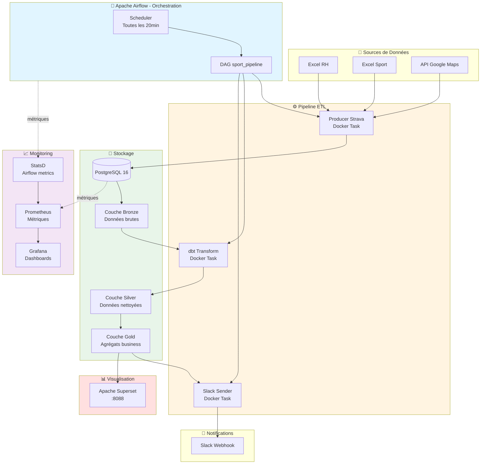

# 🏃‍♂️ Plateforme d'Analyse des Activités Sportives

## 📋 Description

Plateforme moderne de **data engineering** pour suivre, analyser et récompenser les activités sportives des salariés. Pipeline ELT complet avec accent sur la **qualité des données**, la **confidentialité RGPD** et la **scalabilité**.

### 📊 Diagramme des Flux



### 🎯 Fonctionnalités Principales

- **📊 Suivi des Activités** : Running, natation, cyclisme, randonnée, tennis
- **🏢 Données RH** : Business units, salaires, trajets domicile-travail
- **💰 Calcul des Primes** : Mobilité et activités sportives
- **🔄 Orchestration Airflow** : Pipeline automatisé toutes les 20 minutes
- **📈 Monitoring** : Prometheus, Grafana, StatsD
- **💬 Notifications Slack** : Alertes quotidiennes automatiques
- **� Conformité RGPD** : Pseudonymisation, minimisation des données

### 🛠️ Stack Technologique

- **Orchestration** : Apache Airflow 3.1.7 (CeleryExecutor + Redis)
- **Base de données** : PostgreSQL 16 (WAL activé)
- **Transformation** : dbt (architecture médaillon Bronze/Silver/Gold)
- **Monitoring** : Prometheus + Grafana + StatsD
- **Visualisation** : Apache Superset
- **Containerisation** : Docker Compose
- **Notifications** : Slack Webhooks


---

## 🔄 Orchestration avec Apache Airflow

### Architecture Airflow

- **Exécuteur** : CeleryExecutor pour parallélisation
- **Broker** : Redis pour gestion des tâches
- **Scheduler** : Exécution toutes les 20 minutes (`*/20 * * * *`)
- **Workers** : Exécution de tâches Docker via DockerOperator

### DAG `sport_pipeline`

```python
# Flux : load_data → run_dbt → notify_slack
1. load_strava_data    # Extraction données (image: producer_history_strava)
2. run_dbt             # Transformations dbt (image: elt_dbt)
3. notify_slack        # Notifications (image: slack_sender)
```

### Services Airflow

| Service | Port | Description |
|---------|------|-------------|
| `airflow-webserver` | 8080 | Interface web (admin/admin) |
| `airflow-scheduler` | - | Planificateur DAGs |
| `airflow-worker` | - | Exécuteur de tâches |
| `airflow-triggerer` | - | Déclenchement asynchrone |
| `redis` | 6379 | Message broker |
| `postgres` | 5432 | Metastore Airflow |

### Accès & Monitoring Airflow

```bash
# Interface web
http://localhost:8080
Login: airflow / airflow

# Logs
docker compose logs -f airflow-scheduler
docker compose logs -f airflow-worker

# CLI
docker exec -it airflow-worker airflow dags list
docker exec -it airflow-worker airflow tasks test sport_pipeline load_strava_data 2026-02-23
```

---

## 📈 Monitoring & Observabilité

### Stack de Monitoring

| Composant | Port | Fonction |
|-----------|------|----------|
| **Prometheus** | 9090 | Collecte et stockage métriques |
| **Grafana** | 3000 | Dashboards de visualisation |
| **StatsD** | 9125/8125 | Export métriques Airflow |

### Métriques Collectées

#### Airflow (via StatsD)
- Durée d'exécution des DAGs
- Taux de succès/échec des tasks
- Latence du scheduler
- Utilisation des workers

#### PostgreSQL
- Connexions actives
- Requêtes lentes
- Taille de la base
- Performance des index

#### Système
- CPU, RAM, Disk I/O
- État des conteneurs Docker
- Réseau inter-services

### Configuration Prometheus

```yaml
# prometheus.yml (exemple)
scrape_configs:
  - job_name: 'airflow'
    static_configs:
      - targets: ['statsd-exporter:9102']
  
  - job_name: 'postgres'
    static_configs:
      - targets: ['postgres_sport:5432']
```

### Dashboards Grafana

Accéder à Grafana : `http://localhost:3000`

**Dashboards disponibles :**
- Airflow DAG Performance
- PostgreSQL Metrics
- Docker Container Health
- Pipeline Execution Timeline

### Alerting

Prometheus supporte l'alerting via AlertManager :
- DAG échec > 3 fois
- Utilisation DB > 80%
- Latence pipeline > 10min

---

## 🚀 Performance & Scalabilité

### Optimisations

1. **Traitement Incrémental dbt**
   - Modèles incrémentaux : seules les nouvelles données
   - `unique_key='id_activity'` pour upserts efficaces
   - Temps de traitement réduit de 90%

2. **Vues Matérialisées**
   - Silver : Tables matérialisées (données nettoyées)
   - Gold : Agrégats prêts pour BI
   - Requêtes Superset < 100ms

3. **Airflow CeleryExecutor**
   - Parallélisation des tâches
   - Scalabilité horizontale des workers
   - Retry automatique sur échec

4. **PostgreSQL WAL**
   - Write-Ahead Logging pour durabilité
   - `wal_level=logical` pour CDC futur
   - Connexion pooling activé

### Capacités

- **Actuel** : 125+ activités, 50+ salariés
- **Projeté** : Millions d'enregistrements via partitionnement PostgreSQL
- **Scalabilité** : Architecture multi-workers Airflow

---

## 🔒 Sécurité & RGPD

### Protection des Données

1. **Variables d'Environnement** : Tous les secrets dans `.env` (exclu de Git)
2. **Réseau Isolé** : Bridge Docker `sport_network`
3. **Pseudonymisation** : Algorithme de divulgation progressive pour noms
4. **Anonymisation Adresses** : Seule la distance conservée, pas la localisation
5. **Minimisation** : Salaires agrégés, non exposés en dashboards

### Conformité RGPD

✅ Consentement volontaire  
✅ Transparence de l'utilisation  
✅ Droits d'accès et export  
✅ Privacy by Design  
✅ Traçabilité via dbt lineage  

### Recommandations

- [ ] Politique de rétention (7 ans max)
- [ ] Audit logging PostgreSQL
- [ ] SSL/TLS pour données en transit
- [ ] Droit à l'oubli automatisé

---

## 🏗️ Architecture des Données

### Médaillon Bronze → Silver → Gold

```
Bronze (Raw)              Silver (Clean)           Gold (Aggregate)
├─ sport_activities   →   silver_activities    →  gold_per_bu
├─ sport_enterprise   →   silver_enterprise    →  gold_prime_2025
└─ rh_info            →   silver_rh_info       →  gold_slack_messages
                                                   gold_moyen_deplac
                                                   gold_incorrect_transport
```

### Tables Gold - Business Logic

| Table | Description | Refresh |
|-------|-------------|---------|
| `gold_sport_activities_per_bu` | Activités par BU (12 mois) | Incrémental |
| `gold_sport_activities_prime_last_year` | Éligibles prime (>3 activités 2025) | Incrémental |
| `gold_slack_message_activities` | Activités du jour | Incrémental |
| `gold_potential_moyen_deplac_bonus` | Éligibles prime mobilité | Table |
| `gold_incorrect_moyen_deplacement` | Transports invalides | Table |

**Règles de Primes :**
- **Prime Sportive** : >3 activités en 2025
- **Prime Mobilité** : Distance < 25km, transport ≠ marche/vélo, 5% salaire brut

---

## 🛠️ Installation & Configuration

### Prérequis

- Docker & Docker Compose
- Fichier `.env` :

```bash
# PostgreSQL
POSTGRES_USER=postgresuser
POSTGRES_PASSWORD=postgrespw
POSTGRES_DB=sport_activities_db

# Superset
SUPERSET_SECRET_KEY=your_secret_key

# Slack
SLACK_WEBHOOK_URL=https://hooks.slack.com/services/YOUR/WEBHOOK/URL

# Google Maps (optionnel)
GCP_key=your_google_api_key

# Airflow
AIRFLOW_UID=50000
_AIRFLOW_WWW_USER_USERNAME=airflow
_AIRFLOW_WWW_USER_PASSWORD=airflow
```

### Démarrage Rapide

```bash
# Initialiser Airflow (première fois)
docker compose up airflow-init

# Lancer la stack complète
docker compose up -d

# Vérifier les services
docker compose ps

# Accès aux interfaces
open http://localhost:8080  # Airflow
open http://localhost:8088  # Superset
open http://localhost:3000  # Grafana
open http://localhost:9090  # Prometheus
```

### Commandes Utiles

```bash
# Airflow
docker exec -it airflow-worker airflow dags trigger sport_pipeline
docker compose logs -f airflow-scheduler

# dbt
docker exec -it elt_dbt dbt run
docker exec -it elt_dbt dbt test
docker exec -it elt_dbt dbt docs generate

# Monitoring
docker compose logs -f prometheus
docker compose logs -f grafana

# PostgreSQL
docker exec -it postgres_sport psql -U postgresuser -d sport_activities_db
```

---

## 📊 Visualisation & Dashboards

### Apache Superset

**Accès** : `http://localhost:8088` (admin/admin)

**Dashboards disponibles :**
- Activités par Business Unit
- Top salariés actifs
- Primes de mobilité
- Transports invalides
- Tendances mensuelles

**Import dashboards :**
```bash
# Depuis l'interface Superset : Settings > Import
# Fichier : export.zip
```

### Grafana

**Accès** : `http://localhost:3000`

**Dashboards :**
- Airflow Pipeline Metrics
- PostgreSQL Performance
- System Resources
- Container Health

---

## 📈 Logs & Debugging

### Localisation des Logs

```bash
# Airflow logs
logs/dag_id=sport_pipeline/run_id=*/

# dbt logs
dbt/logs/dbt.log

# Pipeline logs (cron)
cron/logs/pipeline.log

# Docker logs
docker compose logs <service_name>
```

### Debugging

```bash
# Vérifier statut DAG
docker exec -it airflow-worker airflow dags state sport_pipeline

# Test task isolée
docker exec -it airflow-worker airflow tasks test sport_pipeline load_strava_data 2026-02-23

# Logs PostgreSQL
docker compose logs postgres_sport

# Métriques temps réel
watch -n 2 'docker compose ps'
```

---

## 🔮 Roadmap

### Court Terme (3-6 mois)
- [ ] Streaming temps réel (Kafka + Debezium CDC)
- [ ] ML détection fraude activités
- [ ] dbt-expectations pour tests avancés
- [ ] Portail self-service salariés

### Moyen Terme (6-12 mois)
- [ ] Intégration API Strava/Garmin/Fitbit
- [ ] OAuth2 pour appareils personnels
- [ ] Politique rétention RGPD automatisée
- [ ] CI/CD GitHub Actions
- [ ] Terraform IaC pour AWS

### Long Terme (12+ mois)
- [ ] Architecture multi-tenant
- [ ] Recommandations IA personnalisées
- [ ] API publique + Webhooks
- [ ] Certification ISO 27001
- [ ] Marketplace templates analytics

---

## 🤝 Contribuer

1. Fork le repo
2. Branche feature (`git checkout -b feature/amazing`)
3. Commit (`git commit -m 'Add amazing feature'`)
4. Push (`git push origin feature/amazing`)
5. Pull Request

---

## 📄 Licence & Support

Projet développé dans le cadre du cursus **Data Engineering OpenClassrooms**.

**Support :** Issues GitHub ou contact thomas.leroy@example.com

---

*Dernière mise à jour : Février 2026 - v2.0 (Airflow + Monitoring)*
