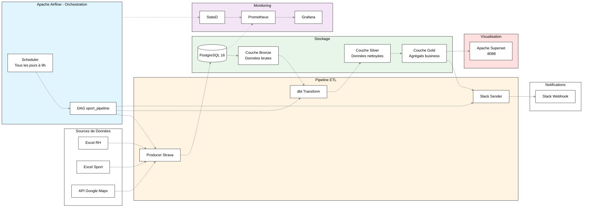

# 🏃‍♂️ Plateforme d'Analyse des Activités Sportives

## Description

Cette pipeline permet de charger, analyser et récompenser les activités sportives des salariés. 
Elle est orchestrée par Airflow, monitoré avec Prometheus/Grafana.

### Diagramme des Flux



### Fonctionnalités Principales

- **Suivi des Activités** : Running, natation, cyclisme, randonnée, tennis etc..
- **Données RH** : Business units, salaires, trajets domicile-travail
- **Calcul des Primes** : Mobilité et activités sportives
- **Orchestration Airflow** : Pipeline automatisé - tous les jours à 9h
- **Monitoring** : Prometheus, Grafana
- **Notifications Slack** : Notifications quotidiennes 
- **Conformité RGPD** : Minimisation des données

---

## 🔄 Orchestration avec Apache Airflow

### DAG `sport_pipeline`

```python
# Flux : load_data → run_dbt → notify_slack
1. load_strava_data    # Extraction données (image: producer_history_strava)
2. run_dbt             # Transformations dbt (image: elt_dbt)
3. notify_slack        # Notifications (image: slack_sender)
```

### Airflow

```bash
# Interface web
http://localhost:8080
```


## Monitoring 

| Composant | Port | Fonction |
|-----------|------|----------|
| **Prometheus** | 9090 | Collecte et stockage métriques |
| **Grafana** | 3000 | Dashboards de visualisation |
| **StatsD** | 9125/8125 | Export métriques Airflow |

### Dashboards Grafana

Accéder à Grafana : `http://localhost:3000`

**Dashboards disponibles :**
- Airflow 
- Airflow DAG Performance
- PostgreSQL Metrics


## Architecture des Données

### Bronze → Silver → Gold

```
Bronze (Raw)              Silver (Clean)           Gold (Aggregate)
├─ sport_activities   →   silver_activities    →  gold_slack_messages_activities / gold_sport_activities_prime_last_year / gold_sport_activities_history_current_year
├─ sport_enterprise   →   silver_enterprise   
└─ rh_info            →   silver_rh_info       →  gold_rh_info / gold_incorrect_moyen_deplacement / gold_potential_moyen_deplac_bonus
```

### Tables Gold - Business Logic

| Table | Description | Refresh |
|-------|-------------|---------|
| `gold_incorrect_moyen_deplacement` | Remplissage incorrect moyen déplacement |  |
| `gold_potential_moyen_deplac_bonus` | Possiblement Éligibles prime déplacement |  |
| `gold_rh_info` | Éligibles prime déplacement |  |
| `gold_slack_message_activities` | Activités du jour | Delete_Insert |
| `gold_sport_activities_history_current_year` | Éligibles prime Sport | Incrémental |
| `gold_sport_activities_prime_last_year` | Prévisionnel prime Sport | Incrémental |

**Règles de Primes :**
- **Prime Sportive** : > 15 activités en 2025
- **Prime Mobilité** : Distance < 25km, transport ≠ marche/vélo, 5% salaire brut

---

## 🛠️ Installation & Configuration

### Prérequis

- Docker & Docker Compose
- Fichier `.env` 

```bash
# PostgreSQL
POSTGRES_USER=
POSTGRES_PASSWORD=
POSTGRES_DB=

# Superset
SUPERSET_SECRET_KEY=

# Slack
SLACK_WEBHOOK_URL=

# Google Maps 
GCP_key=

# Airflow
AIRFLOW_UID=50000
_AIRFLOW_WWW_USER_USERNAME=
_AIRFLOW_WWW_USER_PASSWORD=
```

### Démarrage Rapide

```bash
# Créer les images des 3 conteneurs de la pipeline
docker compose --profile build_only build

# Lancer la stack complète
docker compose up 

# Vérifier les services
docker compose ps

# Accès aux interfaces
open http://localhost:8080  # Airflow
open http://localhost:8088  # Superset
open http://localhost:3000  # Grafana
open http://localhost:9090  # Prometheus

# Arrêter le service
docker compose down

# Arrêter le service avec suppression des volumes
docker compose down -v
```
